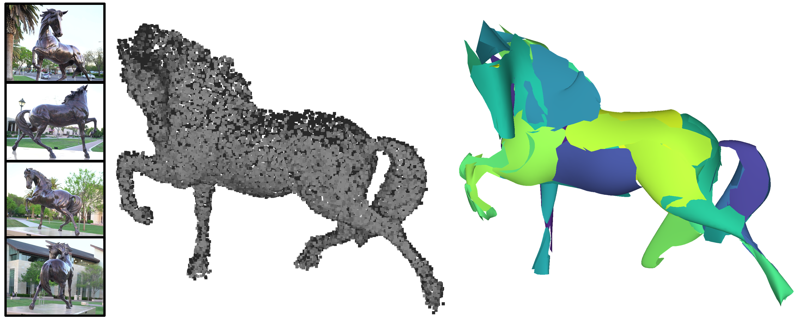

# NURBSFit: Robust Fitting of NURBS Surfaces to Point Clouds

[](https://opensource.org/licenses/MIT)
[](https://www.python.org/)
[](https://developer.nvidia.com/cuda-toolkit)


*Teaser: Our method converts unorganized point clouds (left) into NURBS surface representations (right)*

## 🚀 Quick Start

```bash
git clone https://github.com/lizOnly/nurbsfit.git
```

> For full installation including the required C++ dependency (GoCoPP), see the [Installation](#installation) section below.

---

## Pipeline Overview

NURBSFit is a two-stage pipeline:

1. **GoCoPP (C++) [[2]](#references):** segment the input PLY into planar primitives, write a vertex-group file (`.vg`), a patch adjacency list, and a per-shape metrics file.
2. **NURBSFit (Python):** load GoCoPP outputs, build an energy-weighted adjacency graph, iteratively merge patches that reduce total energy, fit a degree-3 NURBS surface to each merged patch via gradient descent using NURBSDiff [[3]](#references), and trim each surface to its inlier boundary in UV space. Chamfer distance is computed using pytorch3d [[4]](#references).

---

## Repository Layout

```
nurbsfit-v1.0/
  run_merging.py          <- main entry point
  graph_merging.py        <- legacy entry point
  nurbs_patch_fitting.py  <- NURBS evaluation / fitting
  nurbs_merge.py          <- merge geometry helpers
  quadric_fitting.py      <- Taubin quadric error metric
  uv_trimming.py          <- UV-space boundary trimming
  trim_meshes.py          <- mesh trimming utilities
  utils.py                <- I/O, SurfEval wrapper, geometry
  config.yaml             <- global paths and network hyperparameters
  comparison/             <- Chamfer distance helpers
  configuration/          <- merge-config YAML files (per-experiment)
  preprocessing/          <- C++ source patches + batch GoCoPP script
```

Data must sit in sibling directories relative to the repo root:

```
<workspace>/
  nurbsfit-v1.0/                       <- this repository
  NURBS_fit/
    data/<shape>/
      <shape>.ply
      <shape>_planar_primitives_detection.vg
      <shape>_adjacency.txt
      <shape>_GoCopp_metrics.txt
    configuration/                     <- symlink or copy from repo (optional)
  nurbs_fitting/
    data/<shape>/                      <- outputs written here
```

---

## Installation

### 1. Build GoCoPP (C++)

GoCoPP [[2]](#references) is the planar primitive detector by Mulin Yu and Florent Lafarge (INRIA). It must be compiled before running NURBSFit. The version required is the **modified fork** that adds adjacency-list export and the metrics file — both consumed by NURBSFit at runtime.

#### 1.1 Download the source

```bash
# Download the original GoCoPP source
wget https://www-sop.inria.fr/members/Florent.Lafarge/code/GoCoPP.zip
unzip GoCoPP.zip -d GoCoPP_original

# Clone this repository
git clone https://github.com/lizOnly/nurbsfit-v1.0.git

# Copy the three modified files into the original source tree
cp nurbsfit-v1.0/preprocessing/shape_detector.h   GoCoPP_original/source/GoCoPP/include/
cp nurbsfit-v1.0/preprocessing/shape_detector.cpp  GoCoPP_original/source/GoCoPP/src/
cp nurbsfit-v1.0/preprocessing/main.cpp            GoCoPP_original/source/GoCoPP/src/
```

**What the modifications add:**  
- `test_connected_primitives()` — builds a patch adjacency matrix from the k-NN graph.  
- `save_primitive_conection(filename)` — writes `<shape>_adjacency.txt` (one line per patch: neighbour count followed by neighbour indices).  
- `save_metrics(filename)` — writes `<shape>_GoCopp_metrics.txt` with keys `npoints`, `epsilon`, `bbox_diagonal`, `KNN`, `normal_threshold`, `primitives`, `coverage`, `mean_error`, `mean_normal_deviation`.  
- Both output files are required by `run_merging.py`.

#### 1.2 Install C++ dependencies

GoCoPP requires CGAL 5.2.x, Eigen 3, and Boost (filesystem). On Ubuntu:

```bash
sudo apt-get update
sudo apt-get install -y libboost-filesystem-dev libeigen3-dev
```

CGAL 5.2.x must be installed from source (the Ubuntu package is usually a different version):

```bash
wget https://github.com/CGAL/cgal/releases/download/v5.2.4/CGAL-5.2.4.tar.xz
tar xf CGAL-5.2.4.tar.xz
cd CGAL-5.2.4 && mkdir build && cd build
cmake .. -DCMAKE_BUILD_TYPE=Release
sudo make install
```

> 💡 Note the CGAL cmake directory (e.g. `/usr/local/lib/cmake/CGAL`). You will need it in the next step.

#### 1.3 Compile

```bash
cd GoCoPP_original/source
mkdir -p build && cd build
cmake .. -DCGAL_DIR=/path/to/CGAL-5.2.4/lib/cmake/CGAL/ -DCMAKE_BUILD_TYPE=Release
make -j$(nproc)
```

The binary is created at `GoCoPP_original/source/build/bin/Release/GoCoPP`. Note this absolute path — it is needed in the batch preprocessing script.

> For the full list of GoCoPP parameters and their descriptions, refer to the [GoCoPP README](https://www-sop.inria.fr/members/Florent.Lafarge/code/GoCoPP.zip).

---

### 2. Create the Python Environment

```bash
conda create -n nurbsfit python=3.10 -y
conda activate nurbsfit
```

---

### 3. Install PyTorch

Install PyTorch with the CUDA 12.8 index URL to get the sm_120-compatible wheel:

```bash
pip install torch torchvision --index-url https://download.pytorch.org/whl/cu128
```

> ⚠️ Do not install from conda-forge or the default pip index for Blackwell GPUs — only the official CUDA 12.8 wheel includes sm_120 support.

Verify:

```bash
python -c "import torch; print(torch.cuda.is_available(), torch.version.cuda)"
# Expected: True  12.x
```

---

### 4. Install NURBSDiff

NURBSDiff [[3]](#references) provides the differentiable NURBS surface layer (`SurfEval` / `nurbs_eval.py`) used inside the fitting loop in `utils.py`.

> ⚠️ **Important API note:** The NURBSFit codebase calls `SurfEval(..., method='tc', dvc='cuda')`. This is the **older API** of NURBSDiff. The current master branch has **removed** the `method` and `dvc` parameters and replaced them with `device`. You must clone NURBSDiff and patch its initialisation to accept and ignore those legacy parameters.

Clone and install in editable mode:

```bash
git clone https://github.com/idealab-isu/NURBSDiff.git
cd NURBSDiff
pip install einops          # required dependency
pip install -e .
```

If the installed version raises a `TypeError` on the `method` or `dvc` keyword arguments, open `NURBSDiff/nurbs_eval.py` and update the `__init__` signature:

```python
def __init__(self, m, n, dimension=3, p=3, q=3,
             out_dim_u=128, out_dim_v=128,
             knot_u=None, knot_v=None, device='cuda',
             method=None, dvc=None):   # accept legacy args, ignore them
    super().__init__()
    # use `device` kwarg; `method` and `dvc` are ignored
    ...
```

> ⚠️ The class imported in `utils.py` is specifically `from NURBSDiff.nurbs_eval import SurfEval` (the learnable-knot variant), not `surf_eval`. Make sure that module is present and uses the same signature fix if needed.

---

### 5. Install pytorch3d

`utils.py` imports `from pytorch3d.loss import chamfer_distance` [[4]](#references). Build from source for CUDA 12.x / sm_120 support:

```bash
pip install "git+https://github.com/facebookresearch/pytorch3d.git"
```

> ⚠️ Compilation takes several minutes and requires matching CUDA toolkit headers. If the build fails, confirm that `nvcc` and PyTorch report the same CUDA version.

---

### 6. Install Remaining Python Dependencies

```bash
pip install numpy trimesh networkx scipy scikit-image scikit-learn
pip install matplotlib tqdm pyyaml Pillow shapely
pip install open3d pyvista geomdl
```

---

## Usage

### Step 1 — Run GoCoPP on your point clouds

A convenience script is provided at `preprocessing/extract_primitives.sh`. Edit the three variables at the top:

```bash
input_folder="/path/to/your/pointclouds/"       # folder of .ply files
output_folder="/path/to/NURBS_fit/data/"         # output root
executable="/path/to/GoCoPP_original/source/build/bin/Release/GoCoPP"
```

Then run it:

```bash
bash preprocessing/extract_primitives.sh
```

The script iterates over every `.ply` in `input_folder` and calls GoCoPP with `--vg --alpha --hull`. It skips shapes whose output folder already exists. For each shape it produces:

- `<shape>_planar_primitives_detection.vg` — vertex-group file (primitive assignments + plane equations)
- `<shape>_adjacency.txt` — patch adjacency list
- `<shape>_GoCopp_metrics.txt` — epsilon, point count, coverage, etc.
- `<shape>.ply` — copy of the input point cloud

PLY files must contain vertex properties `x y z`. Including `nx ny nz` (normals) is strongly recommended; if absent, GoCoPP estimates them via PCA. For the full list of available GoCoPP parameters, refer to the [GoCoPP README](https://www-sop.inria.fr/members/Florent.Lafarge/code/GoCoPP.zip).

---

### Step 2 — Configure the Merge

NURBSFit uses two levels of configuration:

**`config.yaml`** (repo root) — global paths and network hyperparameters:

```yaml
paths:
  input_dir:  "NURBS_fit/data/"
  output_dir: "nurbs_fitting/data/"

network_params:
  p: 3
  q: 3
  n_ctrpts: 4
  w_lap: 0.1
  w_chamfer: 1
  learning_rate: 0.05
  samples_res: 100
  num_epochs: 20
  mod_iter: 21

options:
  save_points: true
  save_control_polygon: true
  save_colored_mesh: true
```

**`configuration/merge_config_<exp>_scale_<factor>.yaml`** — per-experiment merge behaviour. The default used by `run_merging.py` is `merge_config_exp_80.0_scale_1.0.yaml`. Example contents:

```yaml
exp_number:       80
l_pcoverage:      0.4
l_fidelity:       0.2
l_simplicity:     0.4
epsilon_factor:   1
include_outliers: True
```

Additional pre-tuned configs are provided in `configuration/` using the naming convention `merge_config_exp_<angle>_scale_<epsilon_factor>.yaml`.

---

### Step 3 — Run the Merging Pipeline

```bash
cd nurbsfit-v1.0
python run_merging.py -f <shape_name>
```

Replace `<shape_name>` with the base name of your shape (e.g. `00873042_lessp`). The default when no argument is given is `00873042_lessp`.

### Outputs

| Path | Contents |
|------|----------|
| `merged_surface/` | NURBS mesh patches in OFF format |
| `merged_surface_color/` | Same patches with random per-patch colour (PLY) |
| `merged_surface_points/` | Inlier point clouds per patch (PLY) |
| `merged_trimmed_surface_color/` | Boundary-trimmed coloured meshes (PLY) |
| `merged_control_polygon/` | Control polygon meshes (PLY) |
| `merged_uv_knots/` | Knot vectors and degrees in JSON |
| `uv_trimmed_surface_color/` | UV-trimmed surfaces (PLY) |
| `timings_<shape>.txt` | Elapsed time, memory peak, patch counts |

---

## 🔧 Troubleshooting

**CUDA not detected**
Confirm with `python -c "import torch; print(torch.cuda.is_available())"`. If False, reinstall PyTorch from the CUDA 12.x pip wheel (not the conda channel or CPU wheel).

**`TypeError: unexpected keyword argument 'method'` or `'dvc'` from SurfEval**
Your installed NURBSDiff uses the newer API. Apply the signature patch described in [Section 4](#4-install-nurbsdiff) to `NURBSDiff/nurbs_eval.py`.

**GoCoPP does not write an adjacency or metrics file**
The three modified files were not copied correctly or the binary was not recompiled. Confirm that `test_connected_primitives`, `save_primitive_conection`, and `save_metrics` appear in `shape_detector.h`, re-run cmake, and rebuild.

**`cmake` cannot find CGAL**

```bash
cmake .. -DCGAL_DIR=/path/to/CGAL-5.2.4/lib/cmake/CGAL/ -DCMAKE_BUILD_TYPE=Release
```

**`PlyHeaderParseError` when loading PLY files**
Some PLY files have trailing whitespace in their headers. Strip it in-place:

```python
import pathlib
p = pathlib.Path('file.ply')
p.write_bytes(b'\n'.join(l.rstrip() for l in p.read_bytes().split(b'\n')))
```

**pytorch3d build failure**
Confirm that `nvcc --version` and `python -c "import torch; print(torch.version.cuda)"` both report the same CUDA version.

---

## 📖 Citation

If you use this code in your research, please cite:

```bibtex
@inproceedings{fuentesperez2026nurbsfit,
  title     = {NURBSFit: Robust Fitting of NURBS Surfaces to Point Clouds},
  author    = {Fuentes Perez, Lizeth J. and Lafarge, Florent and Pajarola, Renato},
  booktitle = {International Conference on 3D Vision (3DV)},
  year      = {2026}}
}
```

Please also cite the dependencies used by this work:

```bibtex


@INPROCEEDINGS{{Yu_cvpr22,
  Author = {Yu, Mulin and Lafarge, Florent},
  Title = {Finding Good Configurations of Planar Primitives in Unorganized Point Clouds},
  booktitle = {Proc. of the IEEE conference on Computer Vision and Pattern Recognition (CVPR)},
  Year = {2022},
  address = {New Orleans, US},
}

@misc{nurbsdiff,
  title  = {{NURBSDiff}: A Differentiable {NURBS} Layer for {PyTorch}},
  author = {idealab-isu},
  year   = {2024},
  url    = {https://github.com/idealab-isu/NURBSDiff}
}

@article{ravi2020pytorch3d,
  title   = {Accelerating {3D} Deep Learning with {PyTorch3D}},
  author  = {Nikhila Ravi and Jeremy Reizenstein and David Novotny and Taylor Gordon
             and Wan-Yen Lo and Justin Johnson and Georgia Gkioxari},
  journal = {arXiv:2007.08501},
  year    = {2020}
}

@article{bingol2019geomdl,
  title   = {{NURBS-Python}: An Open-Source Object-Oriented {NURBS} Modeling Framework in {Python}},
  author  = {Bingol, Onur Rauf and Krishnamurthy, Adarsh},
  journal = {SoftwareX},
  volume  = {9},
  pages   = {85--94},
  year    = {2019},
  doi     = {10.1016/j.softx.2018.12.005}
}
```

---

## References

**[1]** Fuentes Perez, L., Lafarge F. and Pajarola, R. *NURBSFit: Robust Fitting of NURBS Surfaces to Point Clouds.* 3DV 2026.

**[2]** Yu, M. and Lafarge, F. *Finding Good Configurations of Planar Primitives in Unorganized Point Clouds.* CVPR 2022. [[Paper]](https://hal.inria.fr/hal-03621896/document) [[Code]](https://www-sop.inria.fr/members/Florent.Lafarge/code/GoCoPP.zip)

**[3]** idealab-isu. *NURBSDiff: A Differentiable NURBS Layer for PyTorch.* [[GitHub]](https://github.com/idealab-isu/NURBSDiff)

**[4]** Ravi, N. et al. *Accelerating 3D Deep Learning with PyTorch3D.* arXiv:2007.08501, 2020. [[arXiv]](https://arxiv.org/abs/2007.08501) [[GitHub]](https://github.com/facebookresearch/pytorch3d)

**[5]** Bingol, O.R. and Krishnamurthy, A. *NURBS-Python: An Open-Source Object-Oriented NURBS Modeling Framework in Python.* SoftwareX, Vol. 9, pp. 85–94, 2019. [[DOI]](https://doi.org/10.1016/j.softx.2018.12.005) [[GitHub]](https://github.com/orbingol/NURBS-Python)

---
